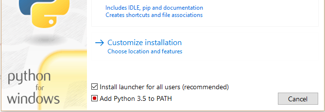

[Português BR](https://github.com/Gilberto-Mascena/How-to-create-a-macOS-installer-without-a-Mac/blob/main/README-pt_br.md) | [English](https://github.com/Gilberto-Mascena/How-to-create-a-macOS-installer-without-a-Mac/blob/main/README.md)

# _Como criar um instalador do macOS genuíno sem acesso a um Mac?_

<div align="center">
    
</div>

### _Bem, isso é relativamente fácil, graças ao bom trabalho do [Time Acidanthera](https://github.com/acidanthera/OpenCorePkg) com macrecovery_

> [!NOTE]
> _Evite imagens distribuídas na internet_
> _Este processo não usará uma imagem completa do macOS, mas sim uma imagem de recovery. Ele baixará tudo dos servidores da Apple que será usado para instalar o macOS no seu PC/Notebook_

#### _Requisitos:_
- _Pen drive USB ou SSD externo com pelo menos 2 GB de espaço disponível_

- _EFI compatível com hardware_

> [!NOTE]
> _Certifique-se de que seu EFI esteja configurado corretamente para permitir acesso à Internet. Isso é um requisito, pois a recuperação baixará o macOS em tempo real dos servidores da Apple_

- _Obviamente, acesso à internet_
- _Baixe a pasta [macrecovery](https://github.com/Gilberto-Mascena/How-to-create-a-macOS-installer-without-a-Mac/releases)_
- _**Windows** ou **Linux**_
- _[Python 3](https://www.python.org/downloads/) instalado na máquina_

<a name="ancora"></a>

## _Navegação por tópicos_

- _**Passo 1**_
- [_No Windows_](#ancora1)
- [_No Linux_](#ancora2)
- _**Passo 2**_
- [_No Windows_](#ancora3)
- [_No Linux_](#ancora4)
- [*Agradecimentos*](#ancora5)
- [*Licença* ](#ancora6)

## _Passo 1_

### _Instalando Python_

<a id="ancora1"></a>

<details><summary><h4>No Windows</h4></summary>

- _Ao instalar no **Windows** marque a opcão `Add Python to PATH`_

<div align="center">
    
</div>

- _Verificando a instalação:_ 
    - _No **Windows**, abra um prompt ou terminal e execute o comando abaixo_

```
python --version
```
- _Se retornar algo como `python 3.x.x`, a instalação foi bem-sucedida e podemos ir para o passo 2_

<div>
    
</div>

[Top](#ancora)
</details>

<a id="ancora2"></a>

<details><summary><h4>No Linux</h4></summary>

- _No **Linux**, o Ubuntu por exemplo, geralmente vem com o Python instalado, então verifique primeiro se você o tem instalado_

    - _Verificando a instalação:_
        - _No **Linux** abra um terminal e execute o comando abaixo_

```
python --version
```

#### _Ou_

```
python3 --version
```

- _Se retornar algo como `python 3.x.x`, o python já está instalado, podemos ir para o passo 1_

<div>
    
</div>


- _Caso contrário, para **Debian** e derivados, no terminal execute o comando abaixo_

```
sudo apt update && sudo apt upgrade -y
```

- _Digite a senha do usuário para atualizar os pacotes e instalar as atualizações no sistema, após o processo ser concluído, execute o comando abaixo_

```
sudo apt install python3 -y
```

- _Digite a senha do usuário para instalação, após a conclusão feche o terminal e abra-o novamente. Por fim, verifique a instalação executando o comando abaixo novamente_

```
python --version
```

#### _Ou_

```
python3 --version
```

- _Se retornar algo como `python 3.x.x`, o python já está instalado, podemos ir para o passo 2_

<div>
    
</div>

[Top](#ancora)
</details>


## _Passo 2_

### _Criando instalador_

<a id="ancora3"></a>

<details><summary><h4>No Windows</h4></summary>

1. [_Baixar o macrecovery_](https://github.com/Gilberto-Mascena/How-to-create-a-macOS-installer-without-a-Mac/releases)
2. _Formatar a unidade flash USB em FAT32_
3. _Abrir a pasta macrecovery baixada anteriormente_

<div>
    
</div>

4. _Abrir o arquivo `recovery_urls.txt`_

<div>
    
</div>

5. _Conforme destacado no título acima, a seção em vermelho baixa a recuperação do macOS Ventura, apenas copiar. O mesmo vale para outras versões._

6. _Abra um terminal na pasta macrecovery e digite `python3`, pressione espaço e cole a url copiada. Pressione Enter e aguarde_

<div>
    
</div>

7. _Esta tela mostra que o download foi concluído com sucesso._

<div>
    
</div>

8. _Volte para a pasta do macrecovery e observe que agora temos a pasta `com.apple.recovery.boot`. Copie a pasta para o pendrive previamente formatado_

<div>
    
</div>

9. _Agora copie seu `EFI` para o pendrive também_ 
    - _A estrutura de pastas e arquivos deve ficar como nas telas abaixo_

<div>
    

- _Arquivos que compõem a pasta `com.apple.recovery.boot`_

    

- _Arquivos que compõem a pasta `EFI`_

<   img src="./assets/windows/oc-folders-win.png">

- _Arquivos que compõem a pasta `oc`_

    
</div>

10. 🎉 _Finalmente temos um pendrive pronto para instalar o macOS escolhido em `recovery_urls.txt`_


[Top](#ancora)
</details>

<a id="ancora4"></a>

<details><summary><h4>No Linux</h4></summary>

1. [_Baixar o macrecovery_](https://github.com/Gilberto-Mascena/How-to-create-a-macOS-installer-without-a-Mac/releases)
2. _Formatar a unidade flash USB em FAT32_
3. _Abrir a pasta macrecovery baixada anteriormente_

<div>

</div>

4. _Abrir o arquivo `recovery_urls.txt`_

<div>

</div>

5. _Conforme destacado no título acima, a seção em vermelho baixa a recuperação do macOS Ventura e apenas a copia. O mesmo vale para outras versões._

6. _Abrir um terminal na pasta macrecovery e digitar `python3`, pressionar espaço e colar a url copiada. Pressione Enter e aguarde_

<div>

</div>

7. _Esta tela mostra que o download foi concluído com sucesso._

<div>

</div>

8. _Volte para a pasta macrecovery e observe que agora temos a pasta `com.apple.recovery.boot`. Copie a pasta para o pendrive formatado anteriormente_

<div>

</div>

9. _Agora copie seu `EFI` para o pendrive também_
- _A estrutura de pastas e arquivos deve ficar como nas telas abaixo_

<div>


- _Arquivos que compõem a pasta `com.apple.recovery.boot`_


- _Arquivos que compõem a pasta `EFI`_


- _Arquivos que compõem a pasta `oc`_


</div>

10. 🎉 _Finalmente temos um pendrive pronto para instalar o macOS escolhido em `recovery_urls.txt`_

[Top](#ancora)
</details>

<a id="ancora5"></a>

## _Agradecimentos_

- [*Acidanthera Team*](https://github.com/acidanthera)
- [*CorpNewt*](https://github.com/corpnewt)
- [*Dortania*](https://dortania.github.io/OpenCore-Install-Guide/config.plist/comet-lake.html#platforminfo)
- [*Dicas do Mateus*](https://www.youtube.com/c/DicasdoMateus)
- [*Gabriel Luchina*](https://www.youtube.com/c/gabrielluchina)
- *And others*

[Top](#ancora)
</details>

<a id="ancora6"></a>

## _Licença_

[_Licença MIT_](./LICENSE.md)(_MIT_)

### Gilberto | Dev _2024_

[Top](#ancora)
</details>