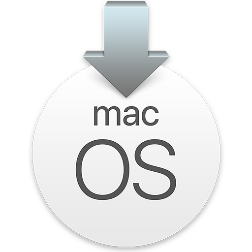
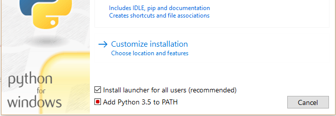

[Português BR](https://github.com/Gilberto-Mascena/How-to-create-a-macOS-installer-without-a-Mac/blob/main/README-pt_br.md) | [English](https://github.com/Gilberto-Mascena/How-to-create-a-macOS-installer-without-a-Mac/blob/main/README.md)

# _Como criar um instalador do macOS genuíno sem acesso a um Mac?_

<div align="center">
    
</div>

### _Bem, isso é relativamente fácil, graças ao bom trabalho da [Time Acidanthera](https://github.com/acidanthera/OpenCorePkg) com macrecovery_

> [!NOTE]
> _Evite imagens distribuídas na internet_
> _Este processo não usará uma imagem completa do macOS, mas sim uma imagem de recovery. Ele baixará tudo dos servidores da Apple que será usado para instalar o macOS no seu PC/Notebook._

#### _Requisitos:_
- _Pen drive USB ou SSD externo com pelo menos 2 GB de espaço disponível_
- _Obviamente, acesso à internet_
- _Baixe a pasta [recovery]()_
- _**Windows** ou **Linux**_
- _[Python 3](https://www.python.org/downloads/) instalado na máquina_

## _Instalado Python_

#### _No Windows_
- _Ao instalar no **Windows** marque a opcão `Add Python to PATH`_

<div align="center">
    
</div>

- _Verificando a instalação:_ 
    - _No **Windows**, abra um prompt ou terminal e execute o comando abaixo_

```
python --version
```
- _Se retornar algo como `python 3.x.x`, a instalação foi bem-sucedida e podemos ir para o passo 1_
----

#### _No Linux_

- _No **Linux**, o Ubuntu por exemplo, geralmente vem com o Python instalado, então verifique primeiro se você o tem instalado_

- _Verificando a instalação:_
- _No **Linux** abra um terminal e execute o comando abaixo_

```
python --version
```

#### _Ou_

```
python3 --version
```

- _Se retornar algo como `python 3.x.x`, o python já está instalado, podemos ir para o passo 1_

- _Caso contrário, para **Debian** e derivados, no terminal execute o comando abaixo_

```
sudo apt update && sudo apt upgrade
```

- _Digite a senha do usuário para atualizar os pacotes e instalar as atualizações no sistema, após o processo ser concluído, execute o comando abaixo_

```
sudo apt install python3
```

- _Digite a senha do usuário para instalação, após a conclusão feche o terminal e abra-o novamente. Por fim, verifique a instalação executando o comando abaixo novamente_

```
python --version
```

#### _Ou_

```
python3 --version
```

- _Se retornar algo como `python 3.x.x`, o python já está instalado, podemos ir para o passo 1_

## _Passo 1_