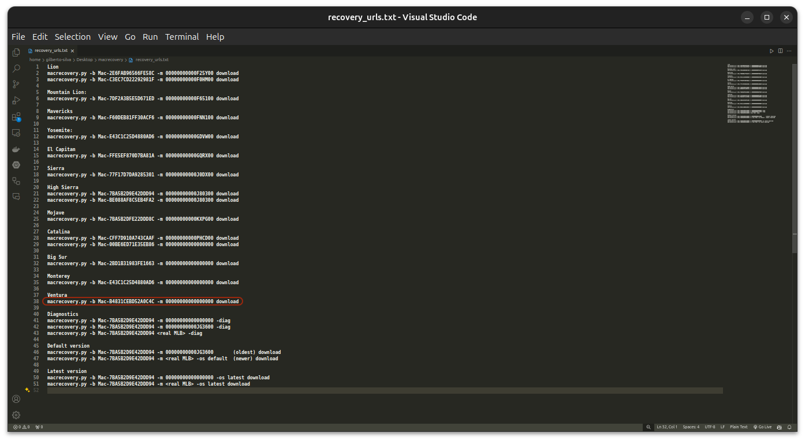

[English](https://github.com/Gilberto-Mascena/How-to-create-a-macOS-installer-without-a-Mac/blob/main/README.md) | [Português BR](https://github.com/Gilberto-Mascena/How-to-create-a-macOS-installer-without-a-Mac/blob/main/README-pt_br.md)

# _How to create a genuine macOS installer without access to a Mac?_

<div align="center">
    
</div>

### _Well, this is relatively easy, thanks to the good work of the [Acidanthera team](https://github.com/acidanthera/OpenCorePkg) with macrecovery_


> [!WARNING]
> _Avoid images distributed on the internet_
> _This process will not use a full macOS image, but rather a recovery image. It will download everything from Apple's servers that will be used to install macOS on your PC/Notebook._ 

#### _Requirements:_
- _USB flash drive or external SSD with at least 2GB of available space_

- _EFI compatible with your hardware_

> [!WARNING]
> _Make sure your EFI is configured correctly to allow internet access this is a requirement, as the recovery will download macOS in real time from Apple's servers_

- _Obviously, internet access_
- _Download the [macrecovery](https://github.com/Gilberto-Mascena/How-to-create-a-macOS-installer-without-a-Mac/releases) folder_
- _**Windows** or **Linux**_
- _[Python 3](https://www.python.org/downloads/) installed on the machine_

## _Step 1_

## _Installing Python_

#### _On Windows_

- _when installing on **Windows** check `Add Python to PATH`_


<div align="center">
    
</div>


- _Checking the installation:_
    - _On **Windows**, open a prompt or terminal and run the command below_

```
python --version
```
- _If it returns something like `python 3.x.x`, the installation was successful and we can go to step 1_

<div>
    
</div>

----

#### _On Linux_

- _On **Linux**, Ubuntu for example, usually comes with Python installed, so check first if you have it installed._  

    - _Checking the installation:_
        - _On **Linux** open a terminal and run the command below_

```
python --version
```
#### _Or_

```
python3 --version
```
- _If it returns something like `python 3.x.x`, the python is already installed, we can go to step 1_

<div>
    
</div>

- _Otherwise, for **Debian** and derivatives, in the terminal run the command below_

```
sudo apt update && sudo apt upgrade -y
```

- _Enter the user password to update the packages and update the system, once the process is complete, run the command below_

```
sudo apt install python3 -y
```
- _Enter the user password for installation, after completion close the terminal and open it again. Finally verify the installation by running the command below again_

```
python --version
```
#### _Or_

```
python3 --version
```

- _If it returns something like `python 3.x.x`, the python is already installed, we can go to step 1_

<div>
    
</div>

## _Step 2_

### _Creating installer_

#### _On Windows_

1. [_Download macrecovery_](https://github.com/Gilberto-Mascena/How-to-create-a-macOS-installer-without-a-Mac/releases)
2. _Format the USB flash drive in FAT32_
3. _Open the previously downloaded macrecovery folder_

<div>
    
</div>

4. _Open the `recovery_urls.txt` file_

<div>
    
</div>

5. _As highlighted in the title above, the section in red downloads the macOS Ventura recovery and just copies it. The same goes for other versions._

6. _Open a terminal in the macrecovery folder and type `python3`, press space and paste the copied url. Press Enter and wait_

<div>
    
</div>

7. _This screen shows the download completed successfully._

<div>
    
</div>

8. _Go back to the macrecovery folder and notice that we now have the `com.apple.recovery.boot` folder. Copy the folder to the previously formatted pendrive_

<div>
    
</div>

9. _Now copy your `EFI` to the pendrive as well_
    - _The folder and file structure should look like the screens below_

<div>
    

- _Files that make up the `com.apple.recovery.boot` folder_

    

- _Files that make up the `EFI` folder_

    

- _Files that make up the `oc` folder_

    
</div>

10. 🎉 _Finally we have a pendrive ready to install the macOS chosen in `recovery_urls.txt`_

---

_On Linux_

1. [_Download macrecovery_](https://github.com/Gilberto-Mascena/How-to-create-a-macOS-installer-without-a-Mac/releases)
2. _Format the USB flash drive in FAT32_
3. _Open the previously downloaded macrecovery folder_

<div>
    
</div>

4. _Open the `recovery_urls.txt` file_


<div>
    
</div>

5. _As highlighted in the title above, the section in red downloads the macOS Ventura recovery and just copies it. The same goes for other versions._

6. _Open a terminal in the macrecovery folder and type `python3`, press space and paste the copied url. Press Enter and wait_

<div>
    
</div>

7. _This screen shows the download completed successfully._

<div>
    
</div>

8. _Go back to the macrecovery folder and notice that we now have the `com.apple.recovery.boot` folder. Copy the folder to the previously formatted pendrive_

<div>
    
</div>

9. _Now copy your `EFI` to the pendrive as well_
    - _The folder and file structure should look like the screens below_

<div>
    

- _Files that make up the `com.apple.recovery.boot` folder_

    

- _Files that make up the `EFI` folder_

    

- _Files that make up the `oc` folder_

    
</div>

10. 🎉 _Finally we have a pendrive ready to install the macOS chosen in `recovery_urls.txt`_

## *Thanks*

- [*Acidanthera Team*](https://github.com/acidanthera)
- [*CorpNewt*](https://github.com/corpnewt)
- [*Dortania*](https://dortania.github.io/OpenCore-Install-Guide/config.plist/comet-lake.html#platforminfo)
- [*Dicas do Mateus*](https://www.youtube.com/c/DicasdoMateus)
- [*Gabriel Luchina*](https://www.youtube.com/c/gabrielluchina)
- *And others*

## *License* 

*The* [*MIT License*](./LICENSE.md) (*MIT*)

### Gilberto | Dev _2024_ 
